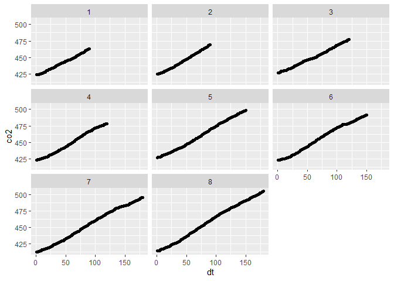

<!-- README.md is generated from README.Rmd. Please edit that file -->

# Script Para Leitura e manipulação dos dados da EGM-5

Todos os dados provenientes da máquina EGM-5 devem ser colocados na
pasta **data-raw**, posteriormente, os dados pré-processados são salvos
na pasta **data**.

## Carregando os pacotes

``` r
library(tidyverse)
library(readr)
library(stringr)
library(janitor)
library(lubridate)
library(writexl)
```

## Definindo os caminhos dos arquivos txt

``` r
caminhos_arquivos <- list.files(path = "data-raw",
           pattern = ".TXT|.txt",
           full.names = TRUE)
```

## Estrutura do arquivo original

As

primeiras colunas são listadas abaixo, após a leitura do arquivos,
deve-se adicionar, organizar,

parâmetros restantes.


``` r
df <- read_csv(caminhos_arquivos[26]) %>% clean_names() %>% 
  drop_na() %>% 
  separate(msoil,c("msoil","process", "dc", "dt", "srl_rate", "srq_rate"),",") %>% 
  mutate(
    across(
      .cols = c("msoil","process", "dc", "dt", "srl_rate", "srq_rate"),
      .fns = as.numeric
    ),
   date = as.Date(date, format="%d/%m/%y")
  ) 

point_count <- 0
df$point <- NA
for(i in 1:nrow(df)){
  if(df$dt[i] == 1) point_count = point_count + 1 
  df$point[i] <- point_count
}
```

Abaixo segue os

parâmetros a serem manipulados


``` r
head(df) 
#> # A tibble: 6 x 23
#>   tag_m3 date       time     plot_no rec_no   co2 pressure  flow   h2o  tsen
#>   <chr>  <date>     <time>     <dbl>  <dbl> <dbl>    <dbl> <dbl> <dbl> <dbl>
#> 1 M5     2022-06-20 22:17:38       1    664   424     959.   225     0     0
#> 2 M5     2022-06-20 22:17:39       1    665   424     959.   226     0     0
#> 3 M5     2022-06-20 22:17:40       1    666   424     959.   225     0     0
#> 4 M5     2022-06-20 22:17:41       1    667   424     959.   225     0     0
#> 5 M5     2022-06-20 22:17:42       1    668   424     959.   225     0     0
#> 6 M5     2022-06-20 22:17:43       1    669   425     959.   225     0     0
#> # ... with 13 more variables: o2 <dbl>, error <dbl>, aux_v <dbl>, par <dbl>,
#> #   tsoil <dbl>, tair <dbl>, msoil <dbl>, process <dbl>, dc <dbl>, dt <dbl>,
#> #   srl_rate <dbl>, srq_rate <dbl>, point <dbl>
```

``` r
df %>% 
  ggplot(aes(x=dt, y=co2)) +
  geom_point() +
  facet_wrap(~point)
```

<!-- --> \## Salvar o
Banco de dados em .xlsx

``` r
caminho_saida <- str_replace(caminhos_arquivos[26],".TXT|.txt",".xlsx")
write_xlsx(df,caminho_saida) 
```

## Calcular a emissão de CO<sub>2</sub> do solo para cada ponto em cada arquivo.

Será utilizada a abordagem de **Parkinson (1981)**


``` r
df
#> # A tibble: 1,088 x 23
#>    tag_m3 date       time     plot_no rec_no   co2 pressure  flow   h2o  tsen
#>    <chr>  <date>     <time>     <dbl>  <dbl> <dbl>    <dbl> <dbl> <dbl> <dbl>
#>  1 M5     2022-06-20 22:17:38       1    664   424     959.   225     0     0
#>  2 M5     2022-06-20 22:17:39       1    665   424     959.   226     0     0
#>  3 M5     2022-06-20 22:17:40       1    666   424     959.   225     0     0
#>  4 M5     2022-06-20 22:17:41       1    667   424     959.   225     0     0
#>  5 M5     2022-06-20 22:17:42       1    668   424     959.   225     0     0
#>  6 M5     2022-06-20 22:17:43       1    669   425     959.   225     0     0
#>  7 M5     2022-06-20 22:17:44       1    670   425     959.   225     0     0
#>  8 M5     2022-06-20 22:17:45       1    671   425     959.   225     0     0
#>  9 M5     2022-06-20 22:17:46       1    672   426     959.   225     0     0
#> 10 M5     2022-06-20 22:17:47       1    673   426     959.   225     0     0
#> # ... with 1,078 more rows, and 13 more variables: o2 <dbl>, error <dbl>,
#> #   aux_v <dbl>, par <dbl>, tsoil <dbl>, tair <dbl>, msoil <dbl>,
#> #   process <dbl>, dc <dbl>, dt <dbl>, srl_rate <dbl>, srq_rate <dbl>,
#> #   point <dbl>
```

### Criando a função para ler vários arquivos, faz os cálculos das estatísticas

dos arquivos.

``` r
egm_5_reader <- function(pasta){
  print(pasta)
  df = read_csv(pasta) %>% clean_names() %>% 
      drop_na() %>% 
      separate(msoil,c("msoil","process", "dc", "dt", "srl_rate", "srq_rate"),",") %>% 
      mutate(
        across(
          .cols = c("msoil","process", "dc", "dt", "srl_rate", "srq_rate"),
          .fns = as.numeric
        ),
        date = as.Date(date, format="%d/%m/%y")
      ) 
    if(nrow(df)!=0){
    point_count = 0
    df$point = NA
    for(i in 1:nrow(df)){
      if(df$dt[i] == 1) point_count = point_count + 1 
      df$point[i] = point_count
    }
    caminho_saida <- str_replace(pasta,".TXT|.txt",".xlsx")
  write_xlsx(df,caminho_saida) }
} 
map(caminhos_arquivos,~egm_5_reader(.x))
#> [1] "data-raw/22062010.TXT"
#> [1] "data-raw/22062110.TXT"
#> [1] "data-raw/22062910.TXT"
#> [1] "data-raw/22062911.TXT"
#> [1] "data-raw/22070210.TXT"
#> [1] "data-raw/22070211.TXT"
#> [1] "data-raw/22070710.TXT"
#> [1] "data-raw/22071310.TXT"
#> [1] "data-raw/22071311.TXT"
#> [1] "data-raw/22071312.TXT"
#> [1] "data-raw/22071313.TXT"
#> [1] "data-raw/22071410.TXT"
#> [1] "data-raw/22071411.TXT"
#> [1] "data-raw/22071412.TXT"
#> [1] "data-raw/22071510.TXT"
#> [1] "data-raw/22071511.TXT"
#> [1] "data-raw/22071512.TXT"
#> [1] "data-raw/22071810.TXT"
#> [1] "data-raw/22071811.TXT"
#> [1] "data-raw/22071812.TXT"
#> [1] "data-raw/22071910.TXT"
#> [1] "data-raw/22071911.TXT"
#> [1] "data-raw/22071912.TXT"
#> [1] "data-raw/22072010.TXT"
#> [1] "data-raw/22072011.TXT"
#> [1] "data-raw/Arquivo original.txt"
#> [[1]]
#> [1] "C:\\GitHub\\egm-5-data-input\\data-raw\\22062010.xlsx"
#> 
#> [[2]]
#> [1] "C:\\GitHub\\egm-5-data-input\\data-raw\\22062110.xlsx"
#> 
#> [[3]]
#> NULL
#> 
#> [[4]]
#> NULL
#> 
#> [[5]]
#> [1] "C:\\GitHub\\egm-5-data-input\\data-raw\\22070210.xlsx"
#> 
#> [[6]]
#> NULL
#> 
#> [[7]]
#> NULL
#> 
#> [[8]]
#> [1] "C:\\GitHub\\egm-5-data-input\\data-raw\\22071310.xlsx"
#> 
#> [[9]]
#> [1] "C:\\GitHub\\egm-5-data-input\\data-raw\\22071311.xlsx"
#> 
#> [[10]]
#> NULL
#> 
#> [[11]]
#> [1] "C:\\GitHub\\egm-5-data-input\\data-raw\\22071313.xlsx"
#> 
#> [[12]]
#> [1] "C:\\GitHub\\egm-5-data-input\\data-raw\\22071410.xlsx"
#> 
#> [[13]]
#> [1] "C:\\GitHub\\egm-5-data-input\\data-raw\\22071411.xlsx"
#> 
#> [[14]]
#> [1] "C:\\GitHub\\egm-5-data-input\\data-raw\\22071412.xlsx"
#> 
#> [[15]]
#> [1] "C:\\GitHub\\egm-5-data-input\\data-raw\\22071510.xlsx"
#> 
#> [[16]]
#> [1] "C:\\GitHub\\egm-5-data-input\\data-raw\\22071511.xlsx"
#> 
#> [[17]]
#> [1] "C:\\GitHub\\egm-5-data-input\\data-raw\\22071512.xlsx"
#> 
#> [[18]]
#> [1] "C:\\GitHub\\egm-5-data-input\\data-raw\\22071810.xlsx"
#> 
#> [[19]]
#> [1] "C:\\GitHub\\egm-5-data-input\\data-raw\\22071811.xlsx"
#> 
#> [[20]]
#> [1] "C:\\GitHub\\egm-5-data-input\\data-raw\\22071812.xlsx"
#> 
#> [[21]]
#> [1] "C:\\GitHub\\egm-5-data-input\\data-raw\\22071910.xlsx"
#> 
#> [[22]]
#> [1] "C:\\GitHub\\egm-5-data-input\\data-raw\\22071911.xlsx"
#> 
#> [[23]]
#> [1] "C:\\GitHub\\egm-5-data-input\\data-raw\\22071912.xlsx"
#> 
#> [[24]]
#> [1] "C:\\GitHub\\egm-5-data-input\\data-raw\\22072010.xlsx"
#> 
#> [[25]]
#> [1] "C:\\GitHub\\egm-5-data-input\\data-raw\\22072011.xlsx"
#> 
#> [[26]]
#> [1] "C:\\GitHub\\egm-5-data-input\\data-raw\\Arquivo original.xlsx"
```
